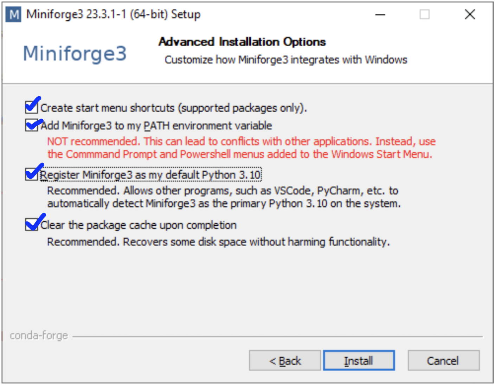
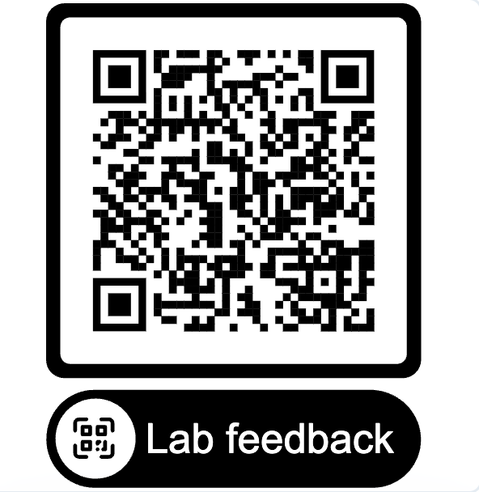

# CSCI218: Foundations of Artificial Intelligence

Welcome to the laboratory repository for **CSCI218: Foundations of Artificial Intelligence**.

## 📅 Lab Overview

<details>
<summary><b>📁 Week 5 — Classification with Neural Networks (MLP & CNN) [Click to expand]</b></summary>

  * **Slides**: Available in `Week5/Week5.pdf`
  * **Lab Notebooks**:
    * `Week5/week5-task1.ipynb`: Task 1 — Image Classification using Multi-Layer Perceptron (MLP with Scikit-Learn & Keras)
    * `Week5/week5-task2.ipynb`: Task 2 — Image Classification using Convolutional Neural Networks (CNN with Keras)
  * **Dataset**: Uses the flower image dataset in `Week3/flowers/` (or `flowers/`).

</details>

<details>
<summary>📁 Week 3 — K-Nearest Neighbours (KNN) [Click to expand]</summary>

  * **Slides**: Available in `Week3/slides/`
  * **Lab Notebooks**:
    * `Week3/week3-task1.ipynb`: Task 1 — Introduction to KNN (Iris Dataset)
    * `Week3/week3-task2.ipynb`: Task 2 — Image Classification using KNN & Color Histograms
  * **Dataset Setup (Action Required)**:
    1. Go to **Moodle** -> **Week 3 Lab**.
    2. Download `flowers.zip`.
    3. Unzip `flowers.zip` directly inside the `Week3/` directory (resulting in `Week3/flowers/`).

</details>


## ⚙️ Environment Setup

If Python/pip is not installed, install **Miniforge** (recommended) or **Anaconda**:

* Download installer from [Miniforge (conda-forge)](https://conda-forge.org/download/).

<details>
<summary>Windows Installation Note</summary>

  Check all options during installation as shown:

  

</details>

<details>
<summary>MacOS Installation Note</summary>

  Run the installer script in **Terminal**:
  ```bash
  cd ~/Downloads
  bash Miniforge3-MacOSX-arm64.sh   # Or Miniforge3-MacOSX-x86_64.sh for Intel
  ```
  > **Important**: For *"Do you wish to update your shell profile to automatically initialize conda? [yes|no]"*, type **`yes`**. After installation, run `source ~/.zshrc`.

</details>


---

Open **Terminal** (macOS) or **PowerShell** (Windows):
```bash
# Run only once
conda create -n csci218 python=3.10 jupyter -y

# At the start of each lab, run these commands:
conda activate csci218
jupyter notebook
```

## Feedback

Provide feedback to help me prepare better lab classes for you in the upcoming weeks. Thank you!

<p align="center">
  <a href="https://forms.gle/Eg5Y9UtGQ4hmDtzN6">
    
  </a>
  <br>
  <a href="https://forms.gle/Eg5Y9UtGQ4hmDtzN6">https://forms.gle/Eg5Y9UtGQ4hmDtzN6</a>
</p>